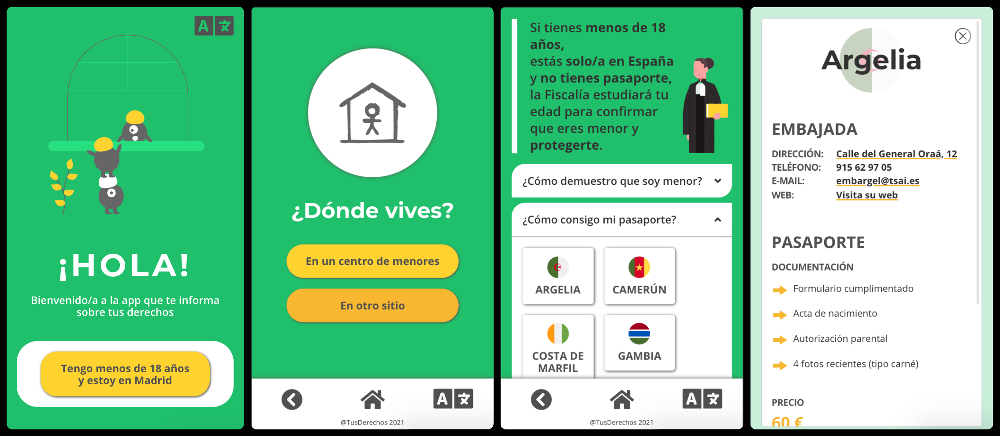

# Children's Rights web app

This is a collaborative project aimed to contribute improving the life of children who have migrated to Spain alone. These children often lack access to information about their rights and how to defend themselves when these are violated.

## The project’s goal

Our goal is to provide migrant children with a free, friendly and multilingual informative app where they can learn about their rights as children, what to do and where to go when they encounter a problem involving these rights.

## Technology

Responsive web app (mobile first) developed with React.js, SASS & Git for version control. No back-end technology needed.

## Beta version

Beta version will only be available in Spanish. More languages and content will be added at later stages.

## Prototype

## Authors

- Concept & content by [Lide Mancisidor](https://www.linkedin.com/in/lide-m-0792a31b4/), Lawyer specializing in Immigration & Children Rights.
- Design & web development by [Celia Martín](https://www.linkedin.com/in/celiamf/), Front-End Developer & African Migration Specialist.

### Attributions

Icons and illustrations by <a href="https://www.flaticon.com/authors/freepik" title="Freepik">Freepik</a> from <a href="https://www.flaticon.com/" title="Flaticon">www.flaticon.com</a>, by <a href="https://undraw.co/search" title="unDraw">unDraw</a> and by <a href="https://thenounproject.com/" title="The Nound Project">The Noun Project</a>.

React Responsive Collapsible Section Component (Collapsible) by <a href="https://github.com/glennflanagan/react-collapsible" title="Glenn Flanagan's Github">Glenn Flanagan</a> - Licensed under the MIT License - Copyright (c) 2017 Glenn Flanagan.
